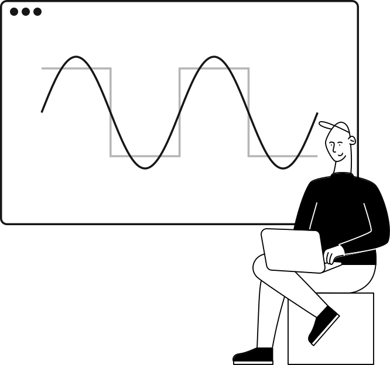

<p align="center">
  
</p>

<h1 align="center">Angularoscope</h1>

<p align="center">
  <strong>Aplicação web para aquisição, visualização e exportação de dados de um osciloscópio usando WebUSB.</strong>
</p>

## Sobre

O Angularoscope foi desenvolvido como um projeto acadêmico no CEFET. A aplicação se comunica diretamente com um osciloscópio conectado por USB, coleta os sinais dos dois canais e apresenta os resultados em tempo real.

O projeto permite:

- localizar e autorizar dispositivos USB pelo navegador;
- visualizar os sinais dos canais 1 e 2;
- calcular corrente elétrica, campo magnético `H` e densidade de fluxo magnético `B`;
- gerar a curva de histerese `B × H`;
- acompanhar frequência, valores RMS, máximos e pico a pico;
- exportar medições individuais para Excel;
- reunir gráficos e medições de uma prática em um arquivo ZIP.

> [!IMPORTANT]
> Este projeto depende de um osciloscópio físico e da API WebUSB. Ele foi mantido com as versões de dependências usadas no trabalho original, pois o fluxo completo não pode ser validado sem o equipamento do laboratório.

## Requisitos

- [Node.js 16](https://nodejs.org/) — versão usada pela automação original do projeto;
- npm;
- Google Chrome ou Microsoft Edge em um computador;
- osciloscópio compatível e cabo USB de dados.

A API WebUSB possui disponibilidade limitada e só funciona em um contexto seguro. Durante o desenvolvimento, `http://localhost` é aceito; em uma publicação, utilize HTTPS. Consulte a [documentação da WebUSB](https://developer.mozilla.org/en-US/docs/Web/API/WebUSB_API) para informações atualizadas de compatibilidade.

## Executando localmente

Clone o repositório e instale exatamente as versões registradas no `package-lock.json`:

```bash
git clone https://github.com/wyltonleone/angularoscope.git
cd angularoscope
npm ci
npm start
```

Abra [http://localhost:4200](http://localhost:4200) no Chrome ou Edge.

Para gerar uma versão de produção:

```bash
npm run build
```

Os arquivos gerados serão salvos em `dist/`.

## Conectando o osciloscópio

1. Ligue o osciloscópio e conecte-o ao computador pelo cabo USB.
2. Abra a aplicação no Chrome ou Edge.
3. Clique em **Adicionar dispositivo**.
4. Selecione o osciloscópio na janela de permissão exibida pelo navegador.
5. Clique no dispositivo quando ele aparecer em **Meus dispositivos**.
6. Informe os parâmetros físicos do experimento nos campos `H` e `B`.
7. Aguarde o início da coleta e acompanhe os gráficos.

O navegador exige que a escolha do dispositivo seja iniciada por uma ação do usuário. Se o equipamento não aparecer, confira o cabo, a alimentação do osciloscópio e as permissões USB do navegador.

## Cálculos

A aplicação usa os seguintes parâmetros:

| Símbolo | Descrição |
| --- | --- |
| `R₁` | Resistência utilizada no cálculo da corrente e de `H` |
| `R₂` | Resistência utilizada no cálculo de `B` |
| `N` | Número de espiras |
| `L` | Comprimento do caminho magnético |
| `A` | Área da seção transversal |
| `C` | Capacitância |
| `Vₚ` | Tensão medida no canal 1 |
| `Vₛ` | Tensão medida no canal 2 |

As grandezas são calculadas por:

```text
I = Vₚ / R₁
H = (N × Vₚ) / (L × R₁)
B = (Vₛ × C × R₂) / (N × A)
```

Antes de iniciar a prática, confirme as unidades e os valores do circuito utilizado no laboratório.

## Coletas e atalhos

Na tela dos gráficos, os atalhos abaixo controlam a sessão de coleta:

| Tecla | Ação |
| --- | --- |
| `c` | Registra a coleta atual, incluindo imagem dos gráficos e planilhas de tensão, corrente e campos |
| `s` | Baixa um ZIP com todas as coletas registradas e uma planilha-resumo |
| `l` | Limpa as coletas armazenadas na sessão atual |

Os botões **Exportar** permitem baixar separadamente os dados do gráfico correspondente.

## Compatibilidade com o equipamento

A comunicação implementada utiliza comandos SCPI sobre USB e espera a configuração USB usada no equipamento original do laboratório: configuração `1`, interface `0`, endpoint de entrada `5` e endpoint de saída `6`.

Outros modelos de osciloscópio podem utilizar interfaces, endpoints, comandos ou formatos de resposta diferentes. Nesses casos, revise principalmente os métodos `start`, `send` e `receive` em `src/app/device/device.component.ts` antes de conectar o equipamento.

## Tecnologias

- Angular 15
- TypeScript
- WebUSB
- Chart.js e ng2-charts
- SheetJS
- html2canvas

## Estrutura do projeto

```text
src/app/devices/   seleção e autorização dos dispositivos USB
src/app/device/    comunicação, cálculos, gráficos e exportações
src/assets/        recursos visuais
```

## Observações

- A coleta acontece inteiramente no navegador; o projeto não possui backend.
- O acesso ao dispositivo precisa ser autorizado novamente conforme as regras do navegador e do sistema operacional.
- Este é um projeto acadêmico preservado como referência. Teste qualquer alteração com o osciloscópio antes de utilizá-la em uma prática de laboratório.
